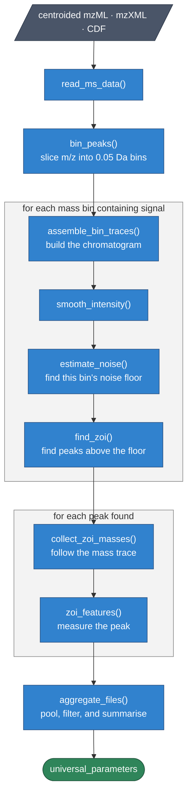

<!-- README.md is generated from README.Rmd. Please edit that file -->

```{r, include = FALSE}
knitr::opts_chunk$set(
  collapse = TRUE,
  comment = "#>",
  fig.path = "man/figures/README-",
  out.width = "100%"
)
```

# paramounter

<!-- badges: start -->
<!-- badges: end -->

Peak picking software such as **xcms**, **MS-DIAL**, and **MZmine** requires the user
to supply processing parameters. Mass tolerance, noise threshold, expected peak width,
and minimum signal-to-noise ratio all have to be set before peak detection can run,
and the results depend heavily on the values chosen.

**paramounter** determines these values by measuring them from the raw data. It
examines individual chromatographic peaks in your files, records how each one behaves,
and summarises those measurements into processing parameters. It does not repeatedly
run a peak picker and score the results, so a single pass over the files is
sufficient. One file takes roughly twenty seconds.

The method was published by
[Guo and Huan (2022)](https://doi.org/10.1021/acs.analchem.1c04758), *Analytical
Chemistry* 94:4260. This package is an independent implementation. The original code
is at [HuanLab/Paramounter](https://github.com/HuanLab/Paramounter), and Jian Guo and
Tao Huan are credited as copyright holders.

## Installation

```r
# install.packages("pak")
pak::pak("wmoldham/paramounter")
```

Input files must be centroided. mzML, mzXML, and CDF are all supported.

## The method

The algorithm works on one narrow mass range at a time. Within such a range the data
are simple enough to separate noise from signal directly, which is what makes the
measurements possible.

````{=markdown}

````

### Step 1. Read the file

`read_ms_data()` reads one data file and returns the m/z values and intensities of
every MS1 scan, together with the retention time of each scan.

### Step 2. Divide the mass range into bins

`bin_peaks()` cuts the m/z axis into slices 0.05 Da wide and assigns every peak from
every scan to a slice. Bins containing no peaks are dropped. All later steps operate
on one bin at a time.

### Step 3. Build a chromatogram for the bin

`assemble_bin_traces()` takes one bin and returns the mean intensity within that bin
at each scan. This is an extracted-ion chromatogram. Scans with no peak in the bin
have an intensity of zero.

### Step 4. Smooth the chromatogram

`smooth_intensity()` applies a weighted moving average. The default half-window is
zero, which leaves the chromatogram unchanged. Increase it for noisy data.

### Step 5. Find the noise floor of the bin

`estimate_noise()` sorts the non-zero intensities from lowest to highest and steps
through them in blocks of ten. At each step it calculates the mean and standard
deviation of all intensities below that point. The scan stops as soon as the next
intensity is greater than the mean plus three standard deviations, which is taken as
the boundary between noise and signal. The intensity at that boundary is the noise
cutoff for the bin. The function returns the cutoff along with the mean and standard
deviation of the noise, both of which are needed later.

Each mass bin receives its own cutoff rather than one global threshold.

### Step 6. Find the peaks

`find_zoi()` locates every run of consecutive scans whose intensity exceeds the noise
cutoff, and identifies the highest point in each run. Each run is a candidate
chromatographic peak, referred to as a zone of interest.

### Step 7. Follow the mass trace of each peak

`collect_zoi_masses()` starts at the top of the peak and moves outward one scan at a
time in both directions. At each scan it records the m/z value closest to the m/z at
the top of the peak. It stops when the intensity falls below the noise cutoff, when a
scan contains no signal in the bin, or when the recorded m/z becomes an outlier by
the Tukey fence test, which indicates that a neighbouring peak has been reached. The
function returns the recorded m/z values and the first and last scan of the peak.

The recorded m/z values are repeated measurements of the same ion. Their spread is
the mass accuracy of the instrument for that ion.

### Step 8. Measure the peak

`zoi_features()` converts the output of step 7 into six numbers.

| measurement | how it is calculated |
|---|---|
| mass tolerance in ppm | `2 × sd(m/z values) / reference m/z × 1e6` |
| mass tolerance in Da | `2 × sd(m/z values)` |
| peak width in seconds | retention time of the last scan minus the first |
| peak width in scans | number of scans spanned |
| signal-to-noise ratio | apex intensity minus noise mean, divided by noise sd |
| peak height | intensity at the top of the peak |

A peak is discarded if its mass trace contains fewer than 2 or more than 199 values,
which removes single-point spikes and runs that have merged with a neighbour.

### Step 9. Mark peaks suitable for measuring drift

`flag_isolated_zoi()` marks peaks that have no neighbouring peak within 300 seconds
in the same mass bin. Only these are used in step 12, because a crowded peak cannot
be matched reliably between files.

### Step 10. Discard unreliable peaks

Steps 3 to 9 repeat for every bin in every file, which typically yields several
thousand measured peaks per file. `aggregate_files()` pools them and applies a
threshold to the ppm measurements. Peaks whose mass trace is too scattered are noise
rather than signal, and would otherwise inflate the mass tolerance.

The threshold is taken from the pooled ppm values, at the 95th percentile of the
lowest 97 percent. It can also be set directly with `ppm_cutoff`.

### Step 11. Trim each set of measurements

Each parameter is summarised by either its maximum or its minimum, so a single
unusual peak could determine the result. `aggregate_files()` discards the most
extreme 3 percent from whichever end of each distribution would otherwise be used.

### Step 12. Measure instrument drift

Given two or more files, `match_zoi_across_files()` pairs the isolated peaks from
step 9 across files, using a window of 0.015 Da and 30 seconds around each peak in
the first file. `estimate_instrument_shift()` then calculates, for each matched peak,
the range of its m/z and the range of its retention time across the files. These
describe how far the instrument drifts between injections.

### Output

`paramounter()` runs all of the above and returns a `universal_parameters` object.
It holds one distribution of measurements per quantity, together with the files and
settings used. The `summary` property tabulates them, and `plot()` draws a histogram
of each.

| quantity | what it describes |
|---|---|
| `ppm`, `mz_diff` | mass accuracy, relative and absolute |
| `noise` | noise floor across mass bins |
| `width_seconds`, `width_scans` | chromatographic peak width |
| `sn` | signal-to-noise ratio |
| `height` | peak intensity |
| `mass_shift`, `rt_shift` | instrument drift between files |

## Converting to software parameters

`to_xcms()`, `to_msdial()`, and `to_mzmine()` convert the measurements into settings.
Each distribution collapses to a single value by taking either its maximum or its
minimum, according to the role the parameter plays.

A tolerance is set from the maximum, so that it is wide enough to accommodate the
worst-behaved genuine peak.

| measurement | xcms parameter |
|---|---|
| largest `ppm` | `ppm` |
| largest `width_seconds` | upper bound of `peakwidth` |
| largest `mass_shift` | `binSize` for grouping |
| largest `rt_shift` | `bw` for grouping |

A threshold is set from the minimum, so that it is low enough to retain the weakest
genuine peak.

| measurement | xcms parameter |
|---|---|
| smallest `noise` | `noise` and the intensity part of `prefilter` |
| smallest `width_scans` | the scan-count part of `prefilter` |
| smallest `sn` | `snthresh`, with a floor of 3 |
| smallest `height` | minimum peak height for MS-DIAL and MZmine |

Peak width is treated as a special case. The bounds are normally the smallest width
rounded up plus 4, and the largest rounded up plus 5. When peaks are broad, meaning
the largest exceeds 35 seconds and peaks are tall relative to their width, the range
becomes 0 to the largest width rounded up plus 7, halved. This suits chromatography
in which a fixed lower bound would reject real peaks.

## Usage

The package ships five urine data files, which the examples below use. Point
`list.files()` at your own directory to analyse your own data.

```r
library(paramounter)

files <- list.files(
  system.file("extdata", package = "paramounter"),
  pattern = "\\.mzXML$",
  full.names = TRUE
)

params <- paramounter(files)

params@summary
plot(params)
```

`to_xcms()` returns the three parameter objects an xcms workflow needs, ready to pass
to the corresponding functions.

```r
xp <- to_xcms(params)

data <- xcms::findChromPeaks(data, xp$chrom_peaks)
data <- xcms::groupChromPeaks(data, xp$group)
data <- xcms::adjustRtime(data, xp$retention)
```

Two or more files are required to measure instrument drift. With a single file the
`mass_shift` and `rt_shift` distributions are empty, `to_xcms()` issues a warning,
and the grouping parameters fall back to defaults.

`to_msdial()` and `to_mzmine()` return a table of parameter names and values, which
are entered into those programs manually.

### Settings

Every setting is held in a `pm_config` object, which is passed to `paramounter()`.
The numeric settings follow the published method.

```r
pm_config(
  bin_width = 0.05,          # width of the mass bins, in Da
  smooth_half_window = 0,    # smoothing applied to each chromatogram
  ppm_cutoff = NULL,         # NULL determines the cutoff from the data
  isolation_gap = 300,       # seconds of separation required by step 9
  match_mz_tol = 0.015,      # matching window used by step 12
  match_rt_tol = 30,
  legacy = FALSE
)
```

`legacy` controls whether the package applies four corrections to the original
implementation or reproduces it exactly.

| behaviour | `legacy = FALSE` (default) | `legacy = TRUE` |
|---|---|---|
| peak width in scans | counts the scans spanned | counts one scan too many |
| a peak counts as isolated when | both neighbours are distant | only the following peak is distant |
| matching peaks across files | takes the closest candidate | takes the first candidate in the window |
| grouping bandwidth for xcms | taken from the measured drift | fixed at 5 |

The default is `FALSE`: the corrections are applied unless you ask for the original.
Set `legacy = TRUE` when you want to compare against published results, as the next
section does.

## Reproducing the published results

The five files shipped with the package are the urine samples distributed with the
original tool. They were acquired on a Bruker maXis impact Q-TOF in positive mode with
reversed-phase chromatography, and each contains 633 MS1 scans.

The call below sets `legacy = TRUE`, since the point here is to match the original.
For a real analysis leave it at its default.

```{r run, message = FALSE, warning = FALSE}
library(paramounter)

files <- list.files(
  system.file("extdata", package = "paramounter"),
  pattern = "\\.mzXML$",
  full.names = TRUE
)

params <- paramounter(files, pm_config(ppm_cutoff = 30, legacy = TRUE))
params@summary
```

```{r xcms, message = FALSE, warning = FALSE}
to_xcms(params)$chrom_peaks
```

Eleven of the twelve values published for this dataset are reproduced exactly.

| parameter | published | paramounter |
|---|---|---|
| `ppm` | 30 | 30 |
| `peakwidth` | 0, 28.5 | 0, 28.5 |
| `mzdiff` | −0.01 | −0.01 |
| `snthresh` | 3 | 3 |
| `integrate` | 1 | 1 |
| `prefilter` | 3, 298 | 3, 298 |
| `noise` | 298 | 298 |
| `bw` | 5 | 5 |
| `minfrac` | 0.5 | 0.5 |
| `minsamp` | 1 | 1 |
| `max` | 100 | 100 |
| `mzwid` | 0.006 | 0.007 |

The ppm cutoff is supplied directly in the call above rather than determined from the
data. The original implementation requires the user to read this number from a plot
and type it into the second half of the analysis. The published value of 30 was
obtained that way. Left to determine the cutoff itself, this package calculates 32.4
and reports a `ppm` of 33.

The remaining difference concerns `mzwid`, the mass window used to group peaks
between samples. It is set from the largest instrument mass drift measured in step
12. One of the 95 matched peaks is paired incorrectly. A peak at m/z 481.12942 in the
first file is matched to a peak at 481.118316 in the fifth, 11 mDa away, although a
peak at 481.128420 lies 1 mDa away in the same window. The original takes the first
candidate found in the matching window rather than the closest, which is what
`legacy = TRUE` reproduces here. The incorrect pairing raises the measured drift from
0.0058 to 0.0071.

Correcting the matching rule on its own would give exactly the published 0.006, but
the default `legacy = FALSE` does not recover it: that setting also changes which
peaks qualify as isolated in step 9, which rebuilds the set of measured peaks and
lands back at 0.0071. So no single setting reproduces all twelve values at once.
Eleven of twelve under `legacy = TRUE` is the honest ceiling, and the reason for the
twelfth is understood. Why the original authors' own run avoided the mis-pairing is
not recoverable: it depends on the order of peaks within the matching window, which
their published output does not record.

## Citation

Please cite the original method.

> Guo J, Huan T. Mechanistic Understanding of the Discrepancies between Common Peak
> Picking Algorithms in Liquid Chromatography–Mass Spectrometry-Based Metabolomics.
> *Analytical Chemistry* 2022, 94(13), 4260–4268.
