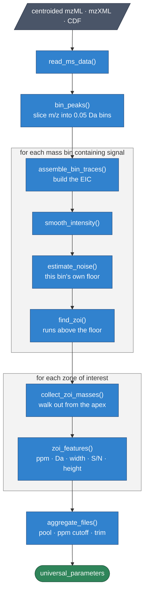
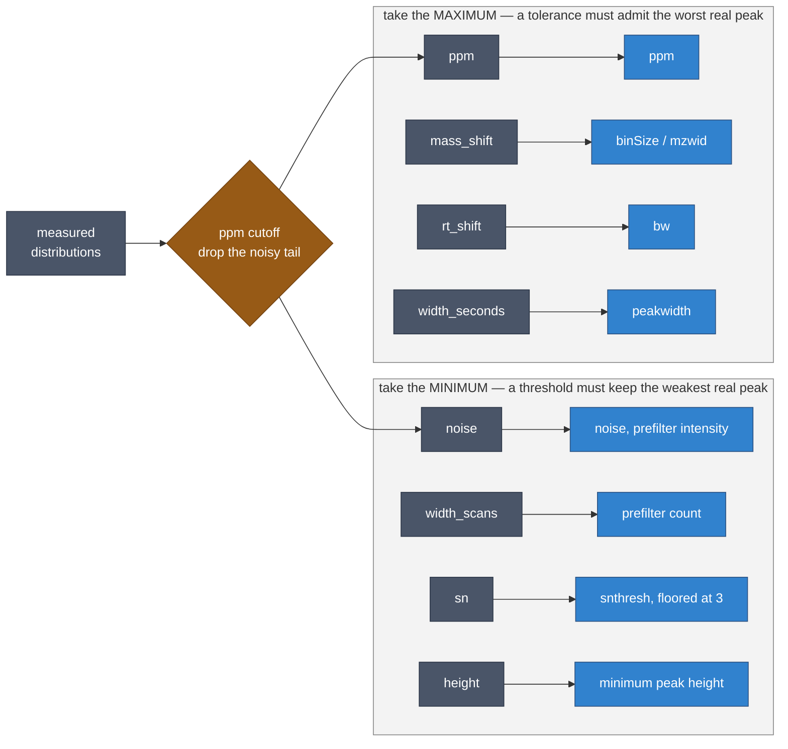

<!-- README.md is generated from README.Rmd. Please edit that file -->

# paramounter

<!-- badges: start -->

<!-- badges: end -->

Most tools that choose LC-MS processing parameters *search* for them:
they run the peak picker many times over and keep whichever settings
score best against some objective function. paramounter does not search.
It **measures** the parameters directly from your raw data — how much
the mass reading of a single ion wanders across a peak, where the noise
floor of each mass bin actually sits, how wide real peaks are, how far
the instrument drifts between injections — and then converts those
physical measurements into settings for xcms, MS-DIAL, and MZmine.

The practical consequence is that it runs once, in about twenty seconds
per file, and the numbers it produces mean something on their own: a
`ppm` of 30 is a statement about your instrument, not the output of an
optimiser.

This package is a port of the method published by [Guo *et al.*
(2022)](https://doi.org/10.1021/acs.analchem.1c04758) (*Anal. Chem.*
**94**:4260), whose original implementation is at
[HuanLab/Paramounter](https://github.com/HuanLab/Paramounter). Jian Guo
and Tao Huan are credited as copyright holders.

## Installation

``` r
# install.packages("pak")
pak::pak("wmoldham/paramounter")
```

## Quick start

``` r
library(paramounter)

files <- list.files("my_data", pattern = "\\.mzML$", full.names = TRUE)
params <- paramounter(files)

params@summary   # the measured distributions
plot(params)     # diagnostic histograms

xp <- to_xcms(params)
data <- xcms::findChromPeaks(data, xp$chrom_peaks)
data <- xcms::groupChromPeaks(data, xp$group)
data <- xcms::adjustRtime(data, xp$retention)
```

At least two files are needed to measure instrument drift; with one file
the mass- and RT-shift distributions come back empty and the alignment
parameters fall back to defaults.

## How a measurement is made

The method never looks at the whole file at once. It slices the m/z axis
into narrow bins, and inside each bin asks a much easier question: *what
does noise look like here, and what rises above it?*



Two ideas carry most of the weight.

**Noise is local.** Rather than one global threshold, each mass bin gets
its own. `estimate_noise()` sorts the bin’s non-zero intensities and
walks up them in blocks; the point where the next value jumps above
`mean + 3 sd` of everything below it is where noise stops and signal
starts. A crowded bin and an empty one get different, appropriate
answers.

**Mass tolerance is measured, not assumed.** From a zone’s apex,
`collect_zoi_masses()` steps outward scan by scan, taking the m/z
closest to the apex m/z each time, and stops at the noise floor or when
a Tukey-fence outlier signals a neighbouring peak. The spread of that
collected trace *is* the instrument’s mass precision for that ion:
`2 × sd(masses) / reference_mz × 1e6` gives ppm.

Every zone contributes one row of measurements, so a typical file yields
several thousand independent observations of each quantity.

## From measurement to parameter

Collapsing thousands of measurements into one number is where the
method’s logic lives, and it is not symmetric. A **tolerance** has to be
wide enough for the worst-behaved genuine peak, so it takes the
**maximum**. A **threshold** has to be low enough to keep the weakest
genuine peak, so it takes the **minimum**.



Three details sit on top of that skeleton:

- **The ppm cutoff** gates everything. Zones whose mass trace is too
  scattered are noise dressed as signal, and they would drag every
  maximum upward. The cutoff is taken from the pooled ppm distribution
  at the 95th percentile of its lowest 97%.
- **Peak width** is conditional. Normally the bounds are
  `ceiling(min) + 4` and `ceiling(max) + 5`; but when peaks are wide
  (`max > 35 s`) and tall relative to their width, the range becomes `0`
  to `(ceiling(max) + 7) / 2`, which suits chromatography where a fixed
  lower bound would reject real peaks.
- **Every distribution is trimmed** by 3% before its statistic is taken,
  from whichever tail is *opposite* the statistic — otherwise a single
  pathological zone would set the parameter.

All of this lives in one place, `point_estimates()`, which the three
translators share.

## Reproducing the published analysis

The package ships the five urine replicates the original authors
distributed with their tool (`inst/extdata`) — a Bruker maXis impact
Q-TOF, RP(+), centroided, 7473 scans per file of which 633 are MS1.

``` r
library(paramounter)

files <- list.files(
  system.file("extdata", package = "paramounter"),
  pattern = "\\.mzXML$",
  full.names = TRUE
)

params <- paramounter(files, pm_config(ppm_cutoff = 30))
params@summary
#>        quantity     n          min          max         mean       median
#> 1           ppm 31562 9.240483e-04 2.998456e+01 7.281215e+00 5.664132e+00
#> 2       mz_diff 30615 1.186609e-07 1.006612e-02 2.160142e-03 1.466130e-03
#> 3         noise 69643 2.980000e+02 3.306000e+03 6.319643e+02 4.640000e+02
#> 4 width_seconds 30615 3.030000e-01 4.924200e+01 7.948537e+00 5.831000e+00
#> 5   width_scans 30615 3.000000e+00 1.900000e+01 4.685416e+00 4.000000e+00
#> 6            sn 30589 2.931752e+00 1.256760e+05 8.544820e+01 1.329299e+01
#> 7        height 30615 4.320000e+02 1.206633e+06 7.956341e+03 2.072000e+03
#> 8    mass_shift    92 3.570680e-04 7.080611e-03 2.020099e-03 1.661789e-03
#> 9      rt_shift    92 7.790000e-01 1.814500e+01 3.548435e+00 2.839000e+00
```

Translating to xcms:

``` r
xp <- to_xcms(params)
xp$chrom_peaks
#> Object of class:  CentWaveParam 
#>  Parameters:
#>  - ppm: [1] 30
#>  - peakwidth: [1]  0.0 28.5
#>  - snthresh: [1] 3
#>  - prefilter: [1]   3 298
#>  - mzCenterFun: [1] "wMean"
#>  - integrate: [1] 1
#>  - mzdiff: [1] -0.01
#>  - fitgauss: [1] FALSE
#>  - noise: [1] 298
#>  - verboseColumns: [1] FALSE
#>  - roiList: list()
#>  - firstBaselineCheck: [1] TRUE
#>  - roiScales: numeric(0)
#>  - extendLengthMSW: [1] FALSE
#>  - verboseBetaColumns: [1] FALSE
```

Against the values published for this dataset (Table S-7 of the
supporting information), **11 of 12 parameters reproduce exactly**:

| parameter   | published | paramounter |     |
|-------------|-----------|-------------|-----|
| `ppm`       | 30        | 30          | ✓   |
| `peakwidth` | 0, 28.5   | 0, 28.5     | ✓   |
| `mzdiff`    | −0.01     | −0.01       | ✓   |
| `snthresh`  | 3         | 3           | ✓   |
| `integrate` | 1         | 1           | ✓   |
| `prefilter` | 3, 298    | 3, 298      | ✓   |
| `noise`     | 298       | 298         | ✓   |
| `bw`        | 5         | 5           | ✓   |
| `minfrac`   | 0.5       | 0.5         | ✓   |
| `minsamp`   | 1         | 1           | ✓   |
| `max`       | 100       | 100         | ✓   |
| `mzwid`     | 0.006     | 0.007       | —   |

Two things about that table are worth stating plainly.

**`ppm_cutoff = 30` is passed explicitly**, and it has to be. In the
original this number is entered by hand: part 1 plots the ppm
distribution with a dashed line and asks the user to read the cutoff off
the chart, which part 2 then hard-codes. The published 30 is that line —
which this package computes at ≈32.4 — rounded down by eye. Left on
automatic, `paramounter()` returns `ppm = 33`. Neither number is wrong;
the original simply has a human in the loop that a port cannot
reproduce.

**The `mzwid` difference is understood.** A verbatim transliteration of
the original’s matching code, run on identical input, returns results
bit-identical to this package’s — so the port is faithful. The
difference comes from the original’s rule for pairing features across
files, which takes the *first* candidate inside the ±0.015 Da window
rather than the closest. On these data that mis-pairs exactly one
feature of 95: an anchor at m/z 481.12942 is matched to 481.118316 in
the fifth file, 11 mDa away, when 481.128420 — 1 mDa away — was sitting
in the same window. That inflated value changes which values survive
trimming, and lifts the result from 0.0058 to 0.0071. Pair on proximity
instead and the answer is 0.0058, which rounds to the published 0.006.

## Reproduction versus correction

`pm_config(legacy = TRUE)`, the default, reproduces the original end to
end — quirks included, because reproducing a published analysis means
reproducing it exactly. Setting `legacy = FALSE` switches four
behaviours at once:

|  | `legacy = TRUE` | `legacy = FALSE` |
|----|----|----|
| peak width in scans | `right − left + 2` (off by one) | `right − left + 1` |
| a zone counts as isolated if | only the *forward* gap is clear | both neighbours are clear |
| cross-file pairing | first candidate in the window | closest candidate |
| xcms grouping `bw` | hard-coded 5 | measured `max(rt_shift)` |

``` r
corrected <- paramounter(files, pm_config(ppm_cutoff = 30, legacy = FALSE))
to_xcms(corrected)$group
#> Object of class:  PeakDensityParam 
#>  Parameters:
#>  - sampleGroups: [1] 1 1 1 1 1
#>  - bw: [1] 7.298
#>  - minFraction: [1] 0.5
#>  - minSamples: [1] 1
#>  - binSize: [1] 0.007080611
#>  - maxFeatures: [1] 100
#>  - ppm: [1] 0
#>  - rtCenterFun: [1] "median"
```

On this dataset the corrected settings give `prefilter` 2 rather than 3
— the off-by-one no longer pads every peak by an extra scan — and a
grouping bandwidth of 7.3 s measured from the data rather than the
inherited constant 5. The stricter isolation rule also admits fewer,
better-separated zones into the drift estimate.

Note that `legacy = FALSE` is *not* a route to the published `mzwid`:
correcting the pairing rule alone would give 0.006, but the flag also
tightens the isolation rule, which rebuilds the set of zones feeding the
estimate. No single setting reproduces all twelve published values, and
11 of 12 is the honest ceiling.

## Design

Every step is exported, documented, and independently tested, so the
pipeline can be driven by hand as easily as through `paramounter()`. The
result object, `universal_parameters`, is deliberately
software-agnostic: it holds distributions, not settings. All rounding,
flooring, and unit conversion happens in the translation layer, which is
why `to_xcms()`, `to_msdial()`, and `to_mzmine()` cannot drift apart.

Correctness is held to a specific standard: every non-trivial function
was checked against a verbatim transliteration of the original code
across thousands of synthetic inputs before being accepted. Where this
package deliberately departs from the original, the departure sits
behind `legacy = FALSE` and is documented.

## Citation

If you use this package, cite the original method:

> Guo J, Huan T. Mechanistic Understanding of the Discrepancies between
> Common Peak Picking Algorithms in Liquid Chromatography–Mass
> Spectrometry-Based Metabolomics. *Analytical Chemistry* 2022,
> 94(13):4260–4268.
